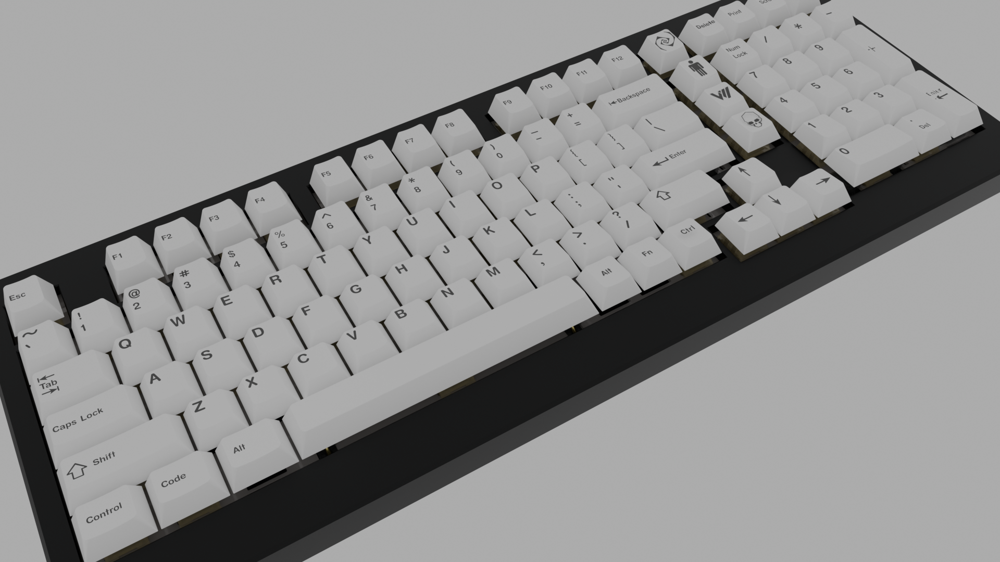
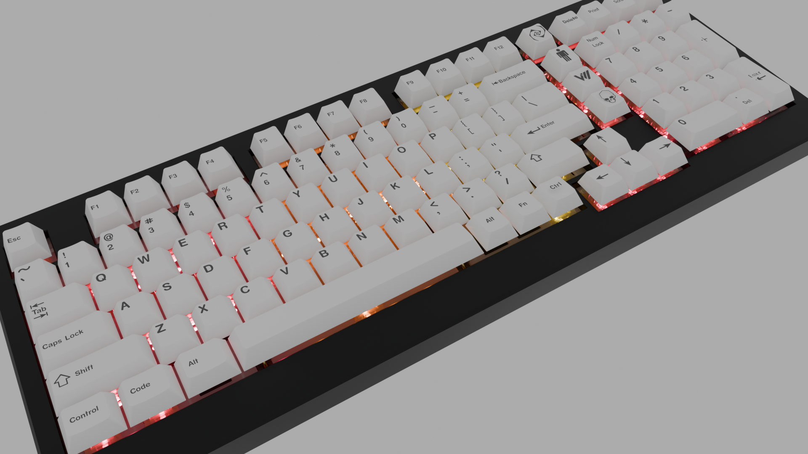
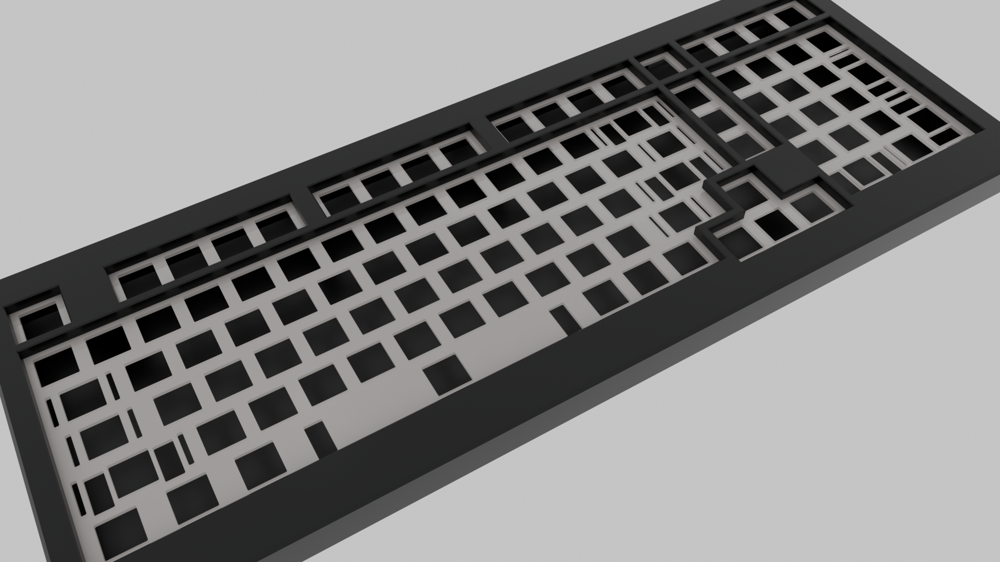
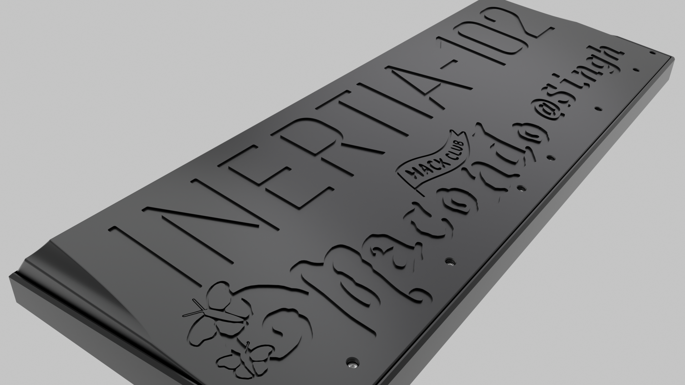
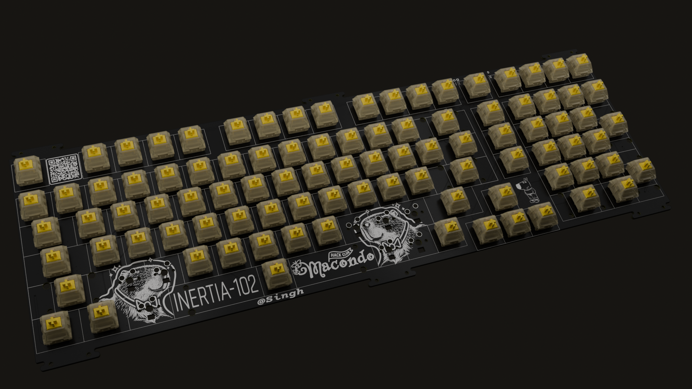
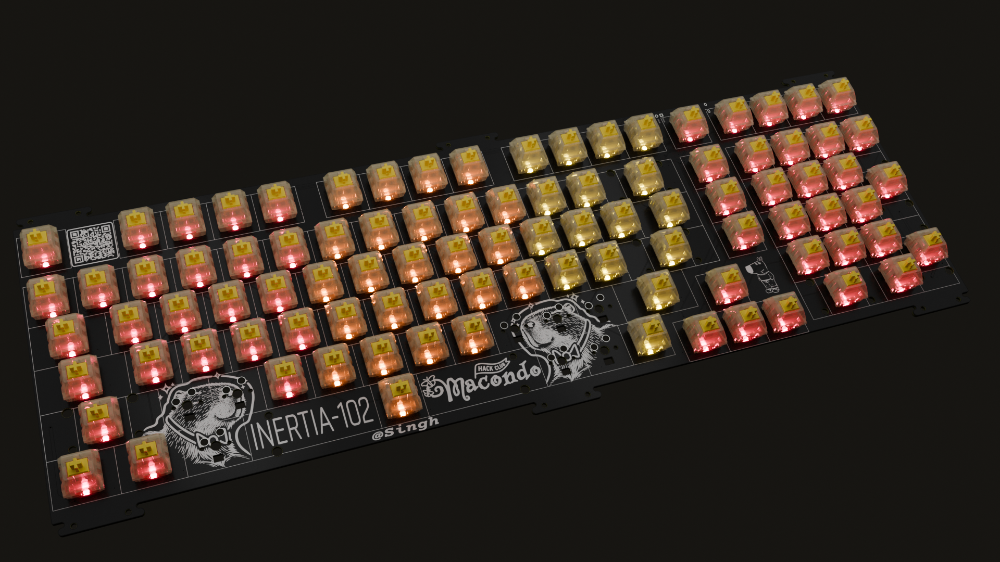
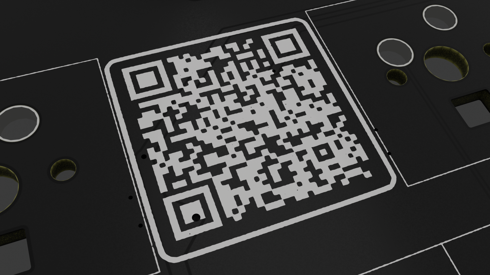
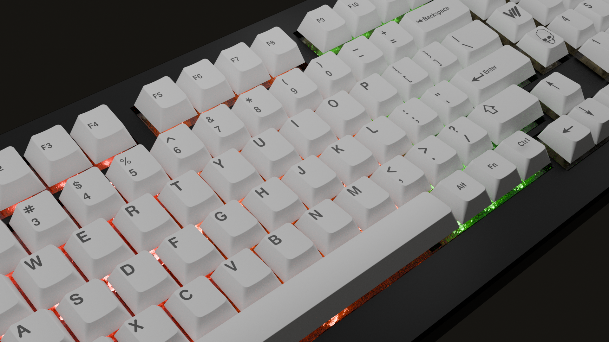
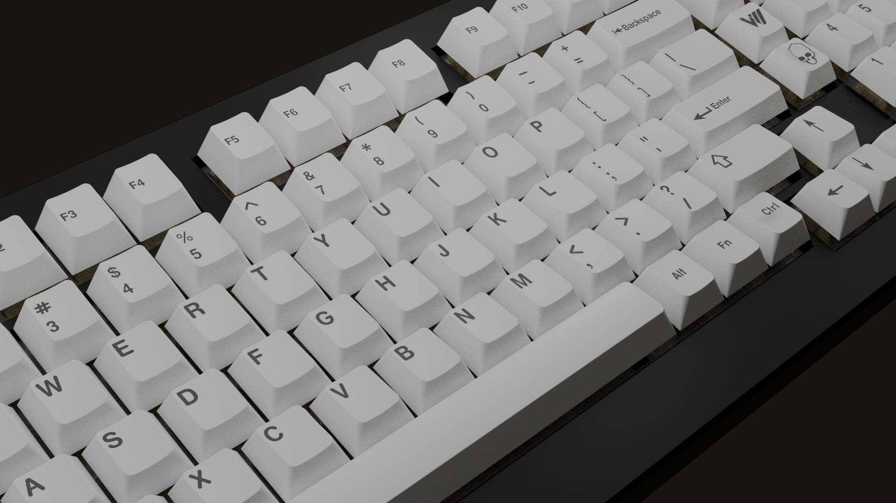
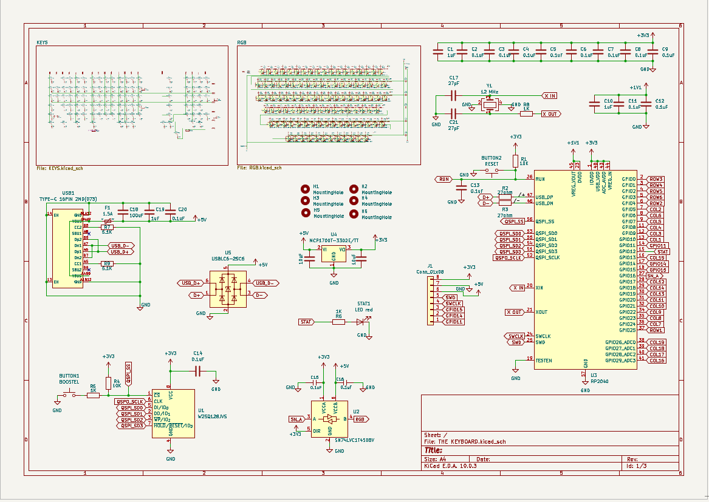

# 'INERTIA-102' The-Mechanical-Keyboard
A fully custom Mechanical Hot-swapable keyboard featuring an integrated RP2040 processor, a lot of RGB and much more!

'INERTIA-102' the name comes from the physics concept defined as the natural tendency of an object to resist changes in its state of motion. Implying the fact that the one using this keyboard is likely to reach a flow state, and the '102' part is just because the keyboard has that many keys 

## Keyfeatures 
- 102 completely customisable keys 
- A built-in MCU-RP2040 and the supporting circuit
- Extra GPIO pins wired for future add-ons
- Completely hotswapable
- Evenly spread out capacitance for suitable RGB function on high-brightness RGB
- Gasket mount(Future option for top and bottom screw mount opean)
- 3d printed case
- ESD & PTC Protecton
- Designed for Cherry-MX type switches and stabilisers

## Renders

<table>
   </tr>
    <td></td>
    <td></td>
   </tr>
  </tr>
    <td></td>
    <td></td>
   </tr>
  </tr>
    <td></td>
    <td></td>
   </tr>
   </tr>
    <td></td>
    <td></td>
   </tr>
    </tr>
    <td></td>
    <td></td>
   </tr>
</table>

## PCB
### Schematic
<table>
  </tr>
    <td></td>
  </tr>
  <table>
    </tr>
    <td></td>
    <td></td>
    
  <tr>
    <td></td>
    <td></td>
  
  </tr>
  </tr>
  <td></td>
  </tr>
</table>

**Front Routing:**

**Back Routing:**

**Front Assembly:**

**Back Assembly:**

